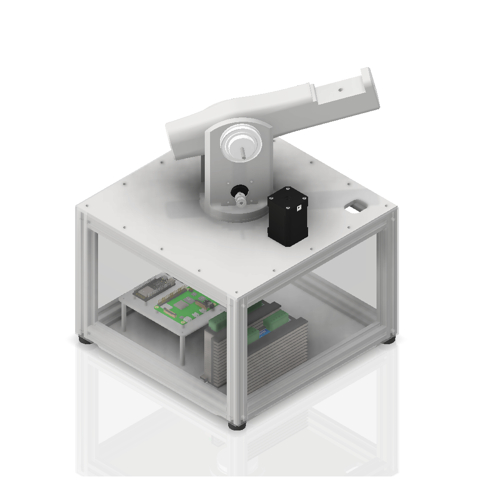
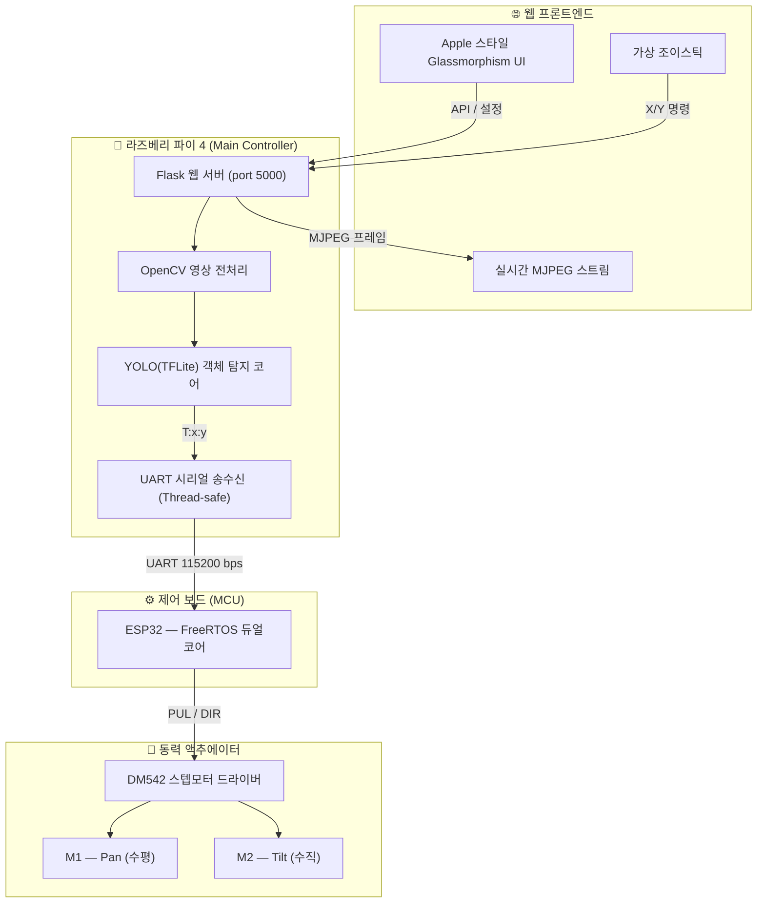
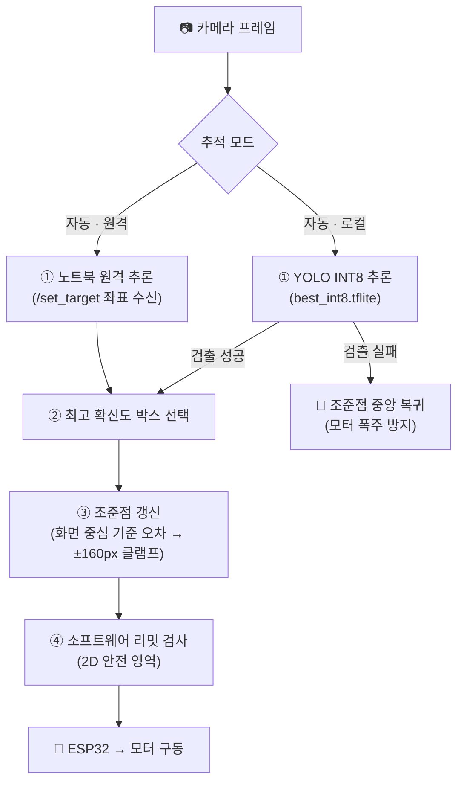

<div align="center">



<br/>


<br/><br/>

> YOLO 객체 인식과 ESP32 스테퍼 모터 정밀 제어를 통해  
> 움직이는 객체를 자동으로 추적하고 모니터링하는 AI 비전 트래커 프로젝트입니다.
> 
> **🏆 v2.0.0 업데이트 내역:**
> - 프로젝트 구조 재정비: `config / core / hardware / web` 패키지 분리
> - 대시보드 프론트엔드를 17개 ES 모듈로 리팩토링 (`web/static/js/`)
> - 소프트웨어 리밋 전면 재작성: 복귀 보장(리밋에 걸려도 반대 방향은 항상 이동 가능)
> - 새 작동 범위 적용: 수직(M2) ±45도, 수평(M1) 360도 (하향 시 160도 자동 제한)
> 
> *(이전 v1.5.0: 다크 모드 웹 개편, 3D 시뮬레이터 최적화 / v1.2.0: Apple Design System 도입 등)*
<br/>

**👉 [📖 초보자를 위한 상세 사용자 가이드 (USER GUIDE) 보러 가기](./docs/USER_GUIDE.md)**

<br/>

</div>

---

## ✨ 주요 기능 및 특징 (Features)

### 🖥️ Apple 스타일 미니멀리즘 플랫 UI (v1.2.0)
- **Apple Design System**: 불필요한 그림자와 입체감을 모두 걷어낸 극도의 미니멀리즘 플랫(Flat) 디자인 적용.
- **직관적인 조작**: 끊김 없이 부드럽게 이어지는 가상 조이스틱과 단일화된 포인트 컬러(Action Blue).
- **상태 모니터링**: `LOCKED`, `SEARCHING` 등 실시간 추적 상태 및 모터 연결 상태 시각화.
- **⎋ 전역 세션 탈출**: 학습·드래그 중 언제든 ESC 키로 즉시 안전 복귀 지원.

### 🤖 지능형 객체 추적 알고리즘 (AI Tracking)
- **YOLO 기반 객체 탐지**: INT8 양자화 TFLite 모델(`best_int8.tflite`)로 매 프레임 대상을 실시간 탐지.
- **원격 추적 오프로딩**: 라즈베리파이의 연산 부담을 줄이기 위해 노트북에서 YOLO 추론을 대신 수행하고 좌표만 전송하는 저지연 모드 지원 (`/set_target`).
- **타겟 유실 안전 정지**: 대상을 놓치면 조준점을 즉시 화면 중앙으로 복귀시켜 모터 폭주를 방지.

### ⚙️ 고성능 하드웨어 제어 (ESP32 & DM542)
- **부드러운 정밀 제어 (S-Curve & P-Control)**: 0 → 3000Hz 속도까지 8.0Hz/ms의 가속도로 부드럽고 강력하게 이동.
- **하드웨어 튜닝 완벽 호환**: 1:5 기어비 (모터 16T / 출력 80T) 등 다양한 물리적 터렛 환경에 대응.
- **실시간 파라미터 동기화**: 웹 UI에서 설정한 가속도, 최대 속도, 픽셀당 이동 거리가 즉각적으로 ESP32 컨트롤러의 타이머 인터럽트에 반영.
- **FOTA(Firmware Over-The-Air)**: 펌웨어 버전 불일치 감지 시 브라우저 상에서 버튼 클릭 한 번으로 ESP32 펌웨어 컴파일 및 업로드 지원 (arduino-cli 연동).

---

## 🏗️ 시스템 아키텍처 (Architecture)

본 프로젝트는 백엔드(AI 연산/서버)와 펌웨어(모터 실시간 제어)가 역할을 분담하여 최상의 퍼포먼스를 발휘합니다.

```text
[ 웹 브라우저 (UI) ] <──(HTTP/API)──> [ Python Flask 서버 (Raspberry Pi/PC) ]
   - 수동 조작 (조이스틱)                - 영상 처리 및 AI 추적 (YOLO/OpenCV)
   - 모터 파라미터 설정                    - 소프트웨어 리밋 · 좌표 연산
   - 실시간 비디오 스트리밍                - 비동기 시리얼 통신 브릿지
                                           │
                                       (Serial/UART)
                                           │
                                   [ ESP32 컨트롤러 ] <──(Pulse/Dir)──> [ DM542 모터 드라이버 ]
                                     - 하드웨어 타이머 제어                - NEMA 스텝 모터 구동
                                     - 정밀 가속도 제어 (accel)            - 1:5 기어비 터렛 물리계
```

### 🔹 아키텍처 데이터 흐름도



---

## 🧠 추적 알고리즘 파이프라인

경량 **YOLO INT8(TFLite)** 모델을 중심으로, 라즈베리파이 단독 추론과 노트북 원격 추론(오프로딩)을 모두 지원합니다.



| 구성 요소 | 역할 |
|:---:|:---|
| **YOLO INT8 (TFLite)** | 양자화된 경량 모델로 라즈베리파이에서도 실시간 객체 탐지 |
| **원격 추적 모드** | 노트북이 YOLO 추론을 대신 수행하고 좌표만 전송 — 파이 CPU 부담 대폭 감소 |
| **오차 클램프** | 한 프레임당 조준점 이동을 ±160px로 제한하여 급격한 모터 동작 방지 |
| **소프트웨어 리밋** | 모터가 물리적 한계를 벗어나지 않도록 서버에서 방향별 차단·감속 |

---

## 🛡️ 모터 작동 범위 및 안전 리밋

터렛의 물리적 파손을 막기 위해 서버(`web/routes/core.py`)에서 2차원 안전 영역을 강제합니다.

| 축 | 작동 범위 | 비고 |
|:---:|:---|:---|
| **M2 (수직)** | 아래 **-45°** ~ 위 **+45°** | |
| **M1 (수평)** | 기본 **360°** (±180°) | 카메라가 **-25° 아래**를 볼 때는 **160°** (±80°)로 자동 제한 (기둥 충돌 방지) |

**동작 원리**
- **방향별 차단**: 리밋을 *벗어나는* 방향만 차단하고, 범위 안으로 *되돌아오는* 방향은 어떤 경우에도 차단하지 않습니다 — 리밋(또는 관성 오버슛)에 걸려도 반대 방향으로 항상 빠져나올 수 있습니다.
- **자동 감속(Soft Braking)**: 리밋 도달 15~20° 전부터 점진적으로 감속하되, 최소 서행 속도를 보장해 리밋 직전에 멈춘 것처럼 보이는 현상을 방지합니다.
- **2D 결합 제한**: 수평이 ±80° 밖에 있으면 수직은 -25° 아래로 내려갈 수 없습니다 (반대 결합도 동일).
- **사용자 리밋**: 웹 UI에서 더 좁은 리밋을 직접 설정할 수 있으며, 설정이 잘못되어 범위가 뒤집히면 자동으로 무시하고 하드웨어 한계로 복귀합니다.

---

## ⚡ 하드웨어 제어 원리

### ESP32 — FreeRTOS 듀얼코어 병렬 처리

| 코어 | 태스크 | 역할 |
|:---:|:---:|:---|
| **Core 0** | `serialTask` | UART 백그라운드 수신 → 목표 좌표 디코딩 및 파라미터(속도,가속도) 실시간 동기화 |
| **Core 1** | `motorTask` | 10 ms 주기 타이머 → DM542 PUL/DIR 펄스 출력 (최대 3000Hz, 가속도 8.0Hz/ms) |

> 두 태스크는 **Semaphore/Mutex** 로 공유 메모리 충돌을 완전 차단합니다. 1:5 기어비를 바탕으로 부드럽고 강력한 이동을 보장합니다.

### 비례 제어 (P-Control)

$$\text{Steps} = \text{constrain}(|\text{Error}| \times \text{steps/px}, 1, \text{max steps})$$

- **오차 大** → 최대 스텝으로 고속 선회  
- **오차 小** → 1~2 스텝으로 섬세하게 접근 (오버슈트 제거)  
- **데드존 진입** (기본 8 px) → 모터 정지로 미세 떨림·마모 완벽 차단

---

## 📊 MCU 통신 모드 비교

| 항목 | 🟢 ESP32 모드 (메인) | 🔵 Arduino 모드 (레거시/폴백) |
|:---|:---|:---|
| **패킷 포맷** | `T:x:y\n` / `CFG:K:V\n` 텍스트 스트림 | 초경량 JSON 인코딩 |
| **오차 연산 주체** | **ESP32 자체**에서 비례 연산 | **라즈베리 파이**에서 스텝 수 계산 후 전송 |
| **반응성** | 연속 좌표 스트림 → 매끄러운 실시간 트래킹 | 이벤트형 동기 구동 → 정밀 포지셔닝 |
| **추천 용도** | 실시간 물체 추적 · 고속 조이스틱 운용 | 스텝 보정 · 위치 실험 · 센서 캘리브레이션 |

---

## 🔧 하드웨어 구성표

| 부품 | 모델 / 사양 |
|:---|:---|
| **메인 컨트롤러** | Raspberry Pi 4 Model B (또는 일반 PC 환경) |
| **카메라** | USB Web Camera / Raspberry Pi CSI Camera |
| **MCU** | ESP32 (Lolin D32 - FreeRTOS 듀얼코어) / Arduino Uno |
| **모터 드라이버** | DM542 (마이크로스텝 지원 스테퍼 드라이버) |
| **터렛 기어비** | 수평/수직 출력측 80T, 모터측 16T (1 : 5 비율) |
| **동력 모터** | NEMA-17 등급 2축 스텝모터 (Pan / Tilt) |
| **통신 스펙** | UART Serial / 115200 bps |

---

## 📂 프로젝트 파일 구조 (Directory Structure)

```text
📦 AI_vision_tracker
 ┣ 📜 main.py              # Flask 서버 진입점 및 스레드 시작
 ┣ 📂 config               # 전역 상태(state.py) — 모터 좌표 · 리밋 · 펌웨어 버전 관리
 ┣ 📂 core                 # 영상 처리 코어 — detector(YOLO) · camera · capture · cli_ui · logger
 ┣ 📂 hardware             # 하드웨어 통신 — motor_esp32 · motor_arduino · serial_utils
 ┣ 📂 web                  # 웹 대시보드 — routes(API) · static/js(ES 모듈 17개) · templates
 ┣ 📂 esp32_firmware       # ESP32 C++ 펌웨어 (타이머 인터럽트 기반, 웹 UI에서 원격 업로드 가능)
 ┣ 📂 data                 # 데이터 — models(YOLO) · learning_data · picture(캡처)
 ┣ 📂 scripts              # 라즈베리파이 설치 · 실행 · 원격 트래킹 스크립트
 ┣ 📂 tests                # 테스트 스크립트
 ┣ 📂 docs                 # 문서 모음 (사용자 가이드 · 체인지로그 · 릴리즈노트 · 이미지)
 ┣ 📂 website              # React 랜딩 페이지 (3D 시뮬레이터, GitHub Pages 배포)
 ┣ 📂 3D_model             # 터렛 3D 모델 원본 (obj / mtl / glb)
 ┣ 📂 raspi_main           # 라즈베리파이 실기 배포용 백엔드 (독립 실행 사본)
 ┗ 📂 archive              # 이전 버전 백업 (esp32_firmware_backup, website_backup)
```

---

## 🚀 설치 및 실행 방법 (How to Run)

### 1. 요구 사항 (Prerequisites)
- **Python 3.11+**
- **Arduino CLI** (웹 UI를 통한 원격 펌웨어 업로드 기능 사용 시)
- 연결된 카메라 (USB/CSI)
- ESP32 개발 보드 및 스텝 모터 드라이버(DM542)

### 2. 의존성 패키지 설치
```bash
pip install -r requirements.txt
```
*(YOLO 추론을 위해 `ultralytics` 패키지가 포함되어 있습니다.)*

### 3. 서버 실행
```bash
python main.py
```
터미널에 표시되는 로컬 IP 혹은 `http://localhost:5000` 으로 접속합니다.

> [!TIP]
> **실시간 추적 가이드**
> 1. 대시보드 하단의 **AI 추적** 버튼(또는 설정 패널의 조작 모드)을 켜면 YOLO가 대상을 자동으로 탐지·추적합니다.
> 2. 수동 제어는 가상 조이스틱으로 — 소프트웨어 리밋이 자동으로 안전 범위를 지켜줍니다.
> 3. 모터 설정 탭에서 터렛의 기어비나 모터 상태에 따라 **steps/px, 최대 속도(Hz), 가속도(Hz/ms)**를 즉시 수정하며 최적의 튜닝값을 찾아보세요.

> [!WARNING]
> **펌웨어 불일치 주의 (v1.2.0~)**  
> 시스템 부팅 시 ESP32 보드의 펌웨어 코드가 서버 측 파이썬 환경의 버전(`EXPECTED_FIRMWARE_VERSION`)과 다를 경우 **위험 방지를 위해 프로그램이 즉시 강제 종료(Hard Crash)** 됩니다. 반드시 `esp32_firmware.ino`를 보드에 최신 버전으로 업로드한 뒤 실행해 주세요!

---

## 🛠️ 트러블슈팅 및 튜닝 가이드

- **추적이 자꾸 풀리거나 버벅일 경우**: 
  웹 UI의 **'기기 설정'**에서 '조준점 반응 속도'를 줄여보세요. 타겟 주변의 조명이 지나치게 어둡거나 밝으면 인식률이 낮아질 수 있습니다. 라즈베리파이 단독 추론이 느리다면 노트북 원격 추적 모드를 사용해 보세요.
- **모터의 속도가 너무 느리거나 과하게 빠른 경우**: 
  웹 UI의 **'모터 튜닝'** 탭에서 **최대 속도(Hz)** 및 **가속도(Hz/ms)** 를 조절하세요. 변경 사항은 즉시 ESP32 인터럽트에 반영됩니다. (DM542 권장 기본값: 3000Hz, 8.0Hz/ms)
- **리밋 근처에서 모터가 느려지는 경우**: 
  정상 동작입니다 — 리밋 15~20° 앞에서 자동 감속(Soft Braking)이 작동하는 것이며, 반대 방향으로는 항상 정상 속도로 움직입니다.

---

<div align="center">
  <p><i>본 프로젝트는 서울로봇고등학교 졸업작품의 일환으로 제작되었습니다.</i></p>
  <p>Made with ❤️ by <b>LSK0522</b></p>
</div>
